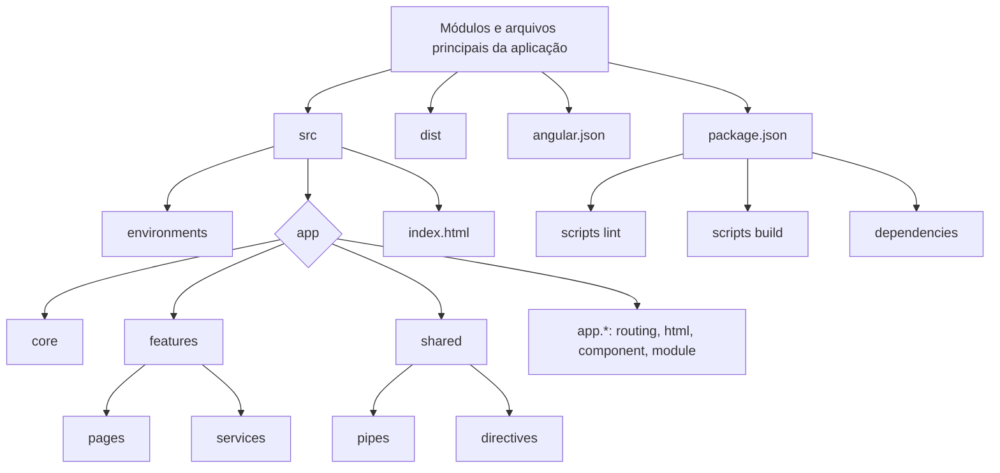
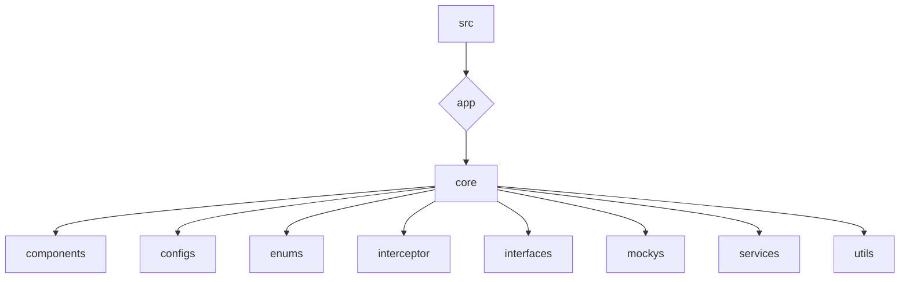
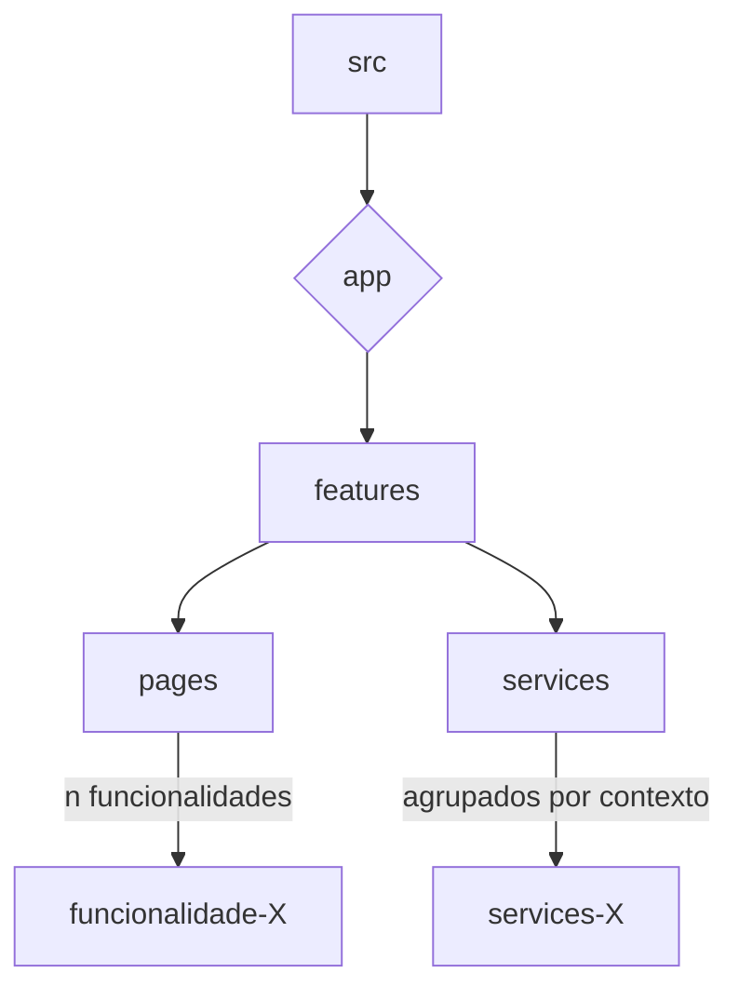
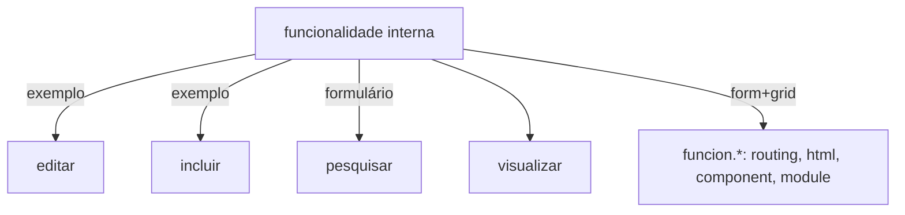
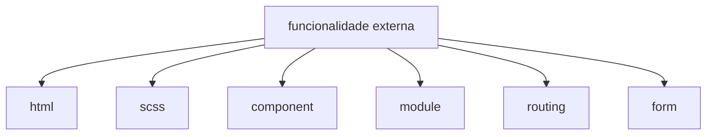
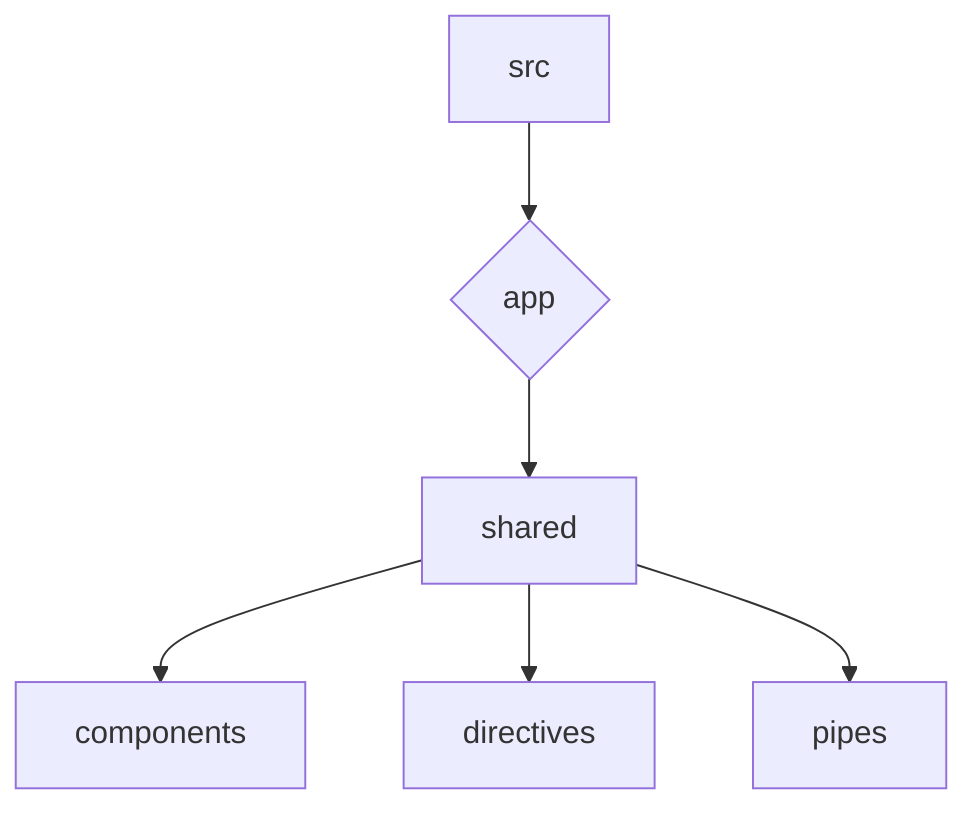

## Estrutura da aplicação



-   **dist** - pasta servida pelo servidor e onde é gerado o build. É declarado no outputPath do angular.json.
-   **angular.json** - configurações do build, environments, baseHref (path base da aplicação e o alias do apache),
    chamada dos assets e styles.
-   **package.json** - Inclui os scripts do lint, build e as dependências.
-   **Environments** - URL's da api e outras variavéis de acordo com o ambiente.
-   **app-routing.module.ts** - Rotas base das funcionalidades com lazy loading para o módulo.
-   **app.component.html** - Contém o router-outlet e libs base: alert, header, menu-lateral, breadcrumbs e footer.
-   **app.component.ts** - Pode ser colocado inicialização da autenticação, consumos iniciais base, alterações do tema
    css.
-   **app.module.ts** - Entre os pontos principais estão: o import dos módulos base do angular, AppRoutingModule (não
    precisando redeclarar os components), SharedModule. E os providers de um Service, Interceptor, etc.

## Módulo Core



A ideia desse módulo é armazenar conteúdos de acordo com seu contexto, que poderão ser reutilizados em mais de um
componente e não entrarão no carregamente inicial.

-   **Components** - Nesse diretório é colocado os cards e modais utilizados nos componentes das páginas.
-   **Configs** - São as consts compartilhadas.

-   **Enums** - Armazena Enums, um tipo no qual declaramos um conjunto de valores constantes pré-definidos, no padrão
    chave valor, em que a chave não pode iniciar com número e recomenda-se ser escrita toda maiuscula separada por
    underscore ( \_ ).
-   **Interceptor** - Armazena HttpInterceptor, o qual intercepta todas as requisições afim de fazer algum tratamento.
    Por exemplo ao ter uma requisição com status http 401 a aplicação é redirecionada para o login.
-   **Interfaces** - Para cada tipagem de valores enviados no corpo do request e response (dados a mais no response
    coloca opcional), como também quando há diversas propriedades num query parameter.
-   **Mockys** - Para mocky (simulador de API) com determinado status http use o
    [designer.mocky.io/design](https://designer.mocky.io/design). Para teste de mockys com o rxjs, simulando um response
    200 ok, seja qual for tipo, array, objeto, string, number.

```ts
export class ModulosMocky {
    static data = [
        {
            nome: 'Manutenção SIGFácil'
        }
    ];
}

public getModulos(): Observable<Array<Menu>> {
    return of(ModulosMocky.data);
}
```

-   **Services** - Esse diretório de services abrange serviços que norteiam toda a aplicação.
    -   **AssetsService** - Utilizado apenas quando precisa-se consumir algum json do Assets Portal, nossa CDN de
        arquivos estáticos.
    -   **BaseService** - Abstração para partes genéricas dos services
    -   **CommonService** - Mapear todos os endpoints GET sem query parameters. Geralmente são os combobox.
    -   **EnvService** - Facilita o uso dos environments na aplicação.
    -   **ExternalFilesService** - Injeção de arquivo css e js caso a DOM já esteja criada.
    -   **UrlUtilService** - Traz vários métodos utéis relacionados a url.
    -   **UserService** - Contém rotas de verificação da aplicação. Estando ok a autentitação, vhost, funcionalidade no
        banco e permissão, pode ser removido os mockys.
-   **Utils** - Armazena classes utilitárias, como mapeamento de mascaras, StorageUtil traz funções quanto ao session
    Storage, funções uteis estão no GeneralsUtil.

## Módulo Features



-   **Pages Features** - Funcionalidades descritas nos cenários da documentação, para cada uma deve ser criada uma pasta
    em pages contendo componente pai da funcionalidade e subcomponentes pesquisa-form e visualizar-pesquisa.
    -   Deve ser copiado de uma funcionalidade existente, alterando o path da pasta e componente raiz.
    -   Essa funcionalidade deve ser mapeada também em: `src/app/app-routing.module.ts`,
        `src/app/core/enums/rotas.enum.ts` e `src/app/core/enums/funcionalidades.enum.ts`
    -   **Forms** - Criação de form dentro do component especifico, colocando cada campo de formulário declarado na
        página.
-   **Services** - Cada enpoint deve ser mapeado de acordo com um grupo de endpoints.

### Estrutura de Funcionalidade Interna

-   src/app/features/pages/funcionalidadeX



### Estrutura de Funcionalidade Externa

-   src/app/features/pages/funcionalidadeX



## Módulo Shared



-   O objetivo desse módulo como o próprio nome já diz é ser compartilhado e tem o sentido de já ser carregado e os
    conteúdos declarados aqui terem um utilização grande, de modo que usar no Core não seria ideal.
-   Pipes para máscara para texto formatado, encontrará dentro de um formatarDadosPesquisa(), por exemplo.
